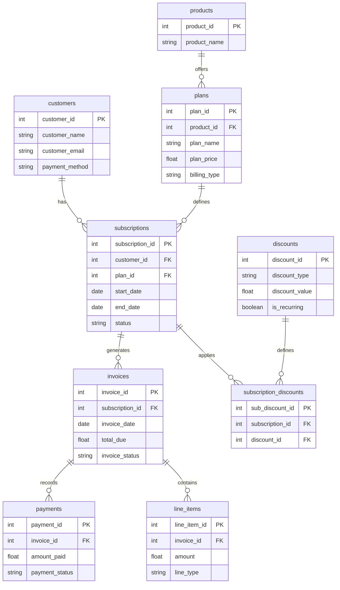
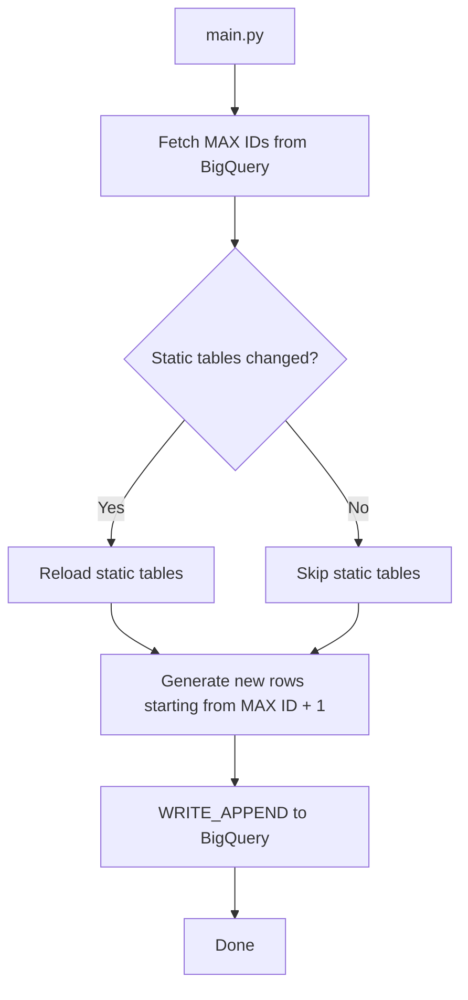

# Synthetic SaaS Billing Dataset

Real SaaS billing data is sensitive and rarely shared publicly, which makes it difficult to practice building analytics pipelines around it. This project simulates a realistic SaaS billing system in Python — generating linked data across customers, subscriptions, invoices, payments, and discounts — and loads it into Google BigQuery for downstream analytics.

The dataset powers a fully built dbt project that models SaaS revenue metrics including Gross MRR, Net MRR, and Collected MRR. → [View the dbt project](https://github.com/jugal-chauhan04/src_analytics_dbt)

---

## The Business Context

**SRC Analytics** is a fictional SaaS company offering a cloud-based productivity suite for small and mid-sized businesses across three products:

| Product | Description |
|---|---|
| **AutomateSRC** | Workflow automation — connects apps like Slack, Gmail, HubSpot, and Salesforce |
| **CollabSRC** | Project management and team collaboration hub |
| **InsightSRC** | Dashboards, data connectors, and reports for sales, marketing, and finance teams |

Each product offers three subscription tiers: **Free**, **Pro**, and **Premium**, billed either monthly or yearly.

---

## Schema Design

The schema models a realistic SaaS billing lifecycle — a customer subscribes to a plan, receives recurring invoices each billing cycle, and makes payments against those invoices. Discounts are defined globally and applied at the subscription level, showing up as negative line items on invoices.



### Table Reference

| Table | Type | Description |
|---|---|---|
| `customers` | Dynamic | One row per customer |
| `subscriptions` | Dynamic | One row per subscription lifecycle — a new row is created on every plan change |
| `invoices` | Dynamic | One invoice per billing cycle per subscription |
| `payments` | Dynamic | One or more payment attempts per invoice (includes retries) |
| `line_items` | Dynamic | Base charge + discount line items per invoice |
| `subscription_discounts` | Dynamic | Maps which discounts are applied to which subscriptions |
| `products` | Static | The three SRC Analytics products |
| `plans` | Static | Nine plans across three products and three tiers |
| `discounts` | Static | Discount codes with type, value, and validity rules |

---

## Data Generation

The generation layer lives in the `extract/` folder and is fully config-driven via `config.py`.

### What gets simulated

**Customer lifecycle** — customers are generated with randomized names, emails, addresses, and payment methods using Faker.

**Subscriptions with plan changes** — approximately 40% of customers change plans during their lifecycle. A plan change closes the current subscription and opens a new one, which means `customer_id` can appear across multiple `subscription_id` records. The possible transitions are upgrade, downgrade, or cancellation.

**Invoices per billing cycle** — invoices are generated for every billing cycle (monthly or yearly) from the subscription start date until cancellation or end date.

**Line items** — each invoice gets a base charge line item for the plan. If a discount is active for that subscription, a negative discount line item is also appended, reducing the `total_due`.

**Discount application** — discounts are applied to ~50% of non-free subscriptions. Recurring discounts apply every billing cycle; one-time discounts apply only on the first cycle.

**Payments with retries** — each invoice gets an initial payment attempt (70% success, 20% fail, 10% pending). Failed or pending attempts are retried up to twice. Free plan invoices are always marked successful with `amount_paid = 0`.

### Project structure

```
extract/
├── config.py          # All configurable parameters — customer count, plans, discounts, probabilities
├── data_generation.py # Core generation functions for all tables
├── schema.py          # BigQuery schema definitions
├── testing.py         # Service account path resolution
└── __init__.py

load/
├── load_to_bq.py      # BigQuery load logic and max ID helper
└── __init__.py

main.py                # Pipeline orchestrator — runs generation then load
```

### Configuration

Key parameters in `config.py`:

```python
N_CUSTOMERS = 10          # Number of new customers per run
START_DATE = 2024-01-01   # Subscription start date range
UPGRADE_PROBABILITY = 0.40 # Fraction of customers who change plans
# Payment probabilities: 70% success, 20% fail, 10% pending
```

Plans, products, and discounts are also defined in `config.py` — changes there flow through to every downstream table automatically.

---

## Load to BigQuery

The load layer (`load/load_to_bq.py`) handles appending generated data into BigQuery with several design principles built in.

### Static vs dynamic tables

Tables are split into two categories with different load behaviour:

**Static tables** (`products`, `plans`, `discounts`) represent reference data that rarely changes. On each run the pipeline compares row counts between the local config and BigQuery. If there's a difference (e.g. a new plan was added), the table is reloaded. If nothing changed, the load is skipped entirely.

**Dynamic tables** (`customers`, `subscriptions`, `invoices`, `payments`, `line_items`, `subscription_discounts`) grow on every run using `WRITE_APPEND` — historical rows are never touched.

### Sequential ID continuity

Because generation functions start fresh on every run, naive implementations would re-use the same IDs and break referential integrity. Before generating any new rows, the pipeline queries BigQuery for the current maximum ID per table:

```sql
SELECT COALESCE(MAX(id), 0) FROM dataset.table
```

New rows are then assigned IDs starting from `MAX(id) + 1`, ensuring IDs remain sequential and unique across runs.

### Schema enforcement

BigQuery schema definitions are declared explicitly in `schema.py` and passed to every load job rather than inferred from the pandas DataFrame. This prevents schema drift — particularly for `DATE` and `TIMESTAMP` fields which pandas can misinterpret if left to auto-detection.

### Execution flow



### Pipeline guarantees

- **No data loss** — append-only, historical rows are never modified or deleted
- **Referential integrity** — surrogate keys remain unique and consistent across runs
- **Incremental growth** — each run expands the dataset cleanly
- **Schema consistency** — explicit schema definitions prevent type mismatches

---

## Getting Started

### Prerequisites

- Python 3.9+
- Google Cloud project with BigQuery enabled
- Service account with BigQuery Data Editor permissions

### Setup

```bash
git clone https://github.com/your-username/your-repo-name
cd your-repo-name
pip install -r requirements.txt
```

Set your service account credentials:

```bash
export GOOGLE_APPLICATION_CREDENTIALS="path/to/your/service-account.json"
```

### Run

```bash
python main.py
```

On the first run, BigQuery tables will be created automatically. Subsequent runs append new data and skip unchanged static tables.

---

## Usefulness of This Dataset

The schema is intentionally designed to support real analytics work:

- **MRR modeling** — the subscription + invoice + payment chain maps directly to Gross, Net, and Collected MRR definitions. Yearly plans require monthly normalization (dividing by 12), which the dbt layer handles.
- **Churn and movement analysis** — because plan changes close one subscription and open another, MRR movement categories (new, expansion, contraction, churn, reactivation) can be derived cleanly from subscription lifecycle events.
- **Payment behavior analysis** — the retry logic and payment status fields support analysis of collection rates and revenue at risk.
- **Discount impact** — line items preserve the pre- and post-discount amounts, enabling gross vs net revenue comparisons.

The dataset scales from a small prototype (10 customers) to a larger analytical dataset by adjusting `N_CUSTOMERS` in `config.py` and running additional incremental loads.

---

## Limitations and Planned Enhancements

This project deliberately simplifies some aspects of SaaS billing to keep the generation logic tractable. Planned additions include:

- Trial mechanics (14-day trials, trial-to-paid conversion tracking)
- Proration for mid-cycle plan changes
- Refunds and chargebacks
- Plan catalog evolution (launching and retiring plans over time)
- Usage-based billing
- Multi-currency support
